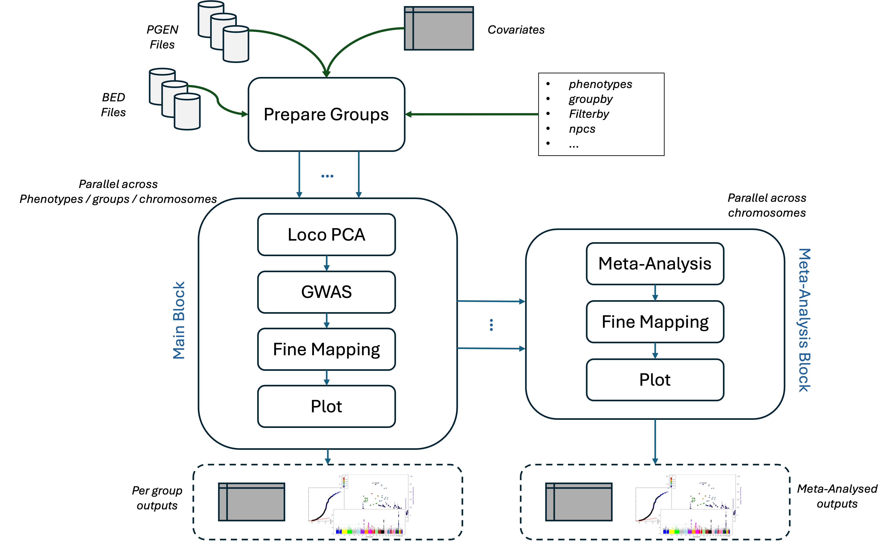

# WDL-GWAS

## Overview

With the [UK Biobank RAP](https://www.ukbiobank.ac.uk/use-our-data/research-analysis-platform/) now serving as the exclusive access point to UK Biobank data, conducting large-scale statistical genetics analyses has become more complex. This repository offers a fully reproducible WDL workflow (RAP-compatible) for genome-wide association studies and fine-mapping, designed to run seamlessly on the RAP and adaptable for use in other computing environments.

## Documentation

Get started [here](https://olivierlabayle.github.io/WDL-GWAS/stable/).

## Get in Touch

To report problems, ask questions or simply give a thumbs up please fill an [issue](https://github.com/olivierlabayle/WDL-GWAS/issues) so that everyone can benefit from the answer!

