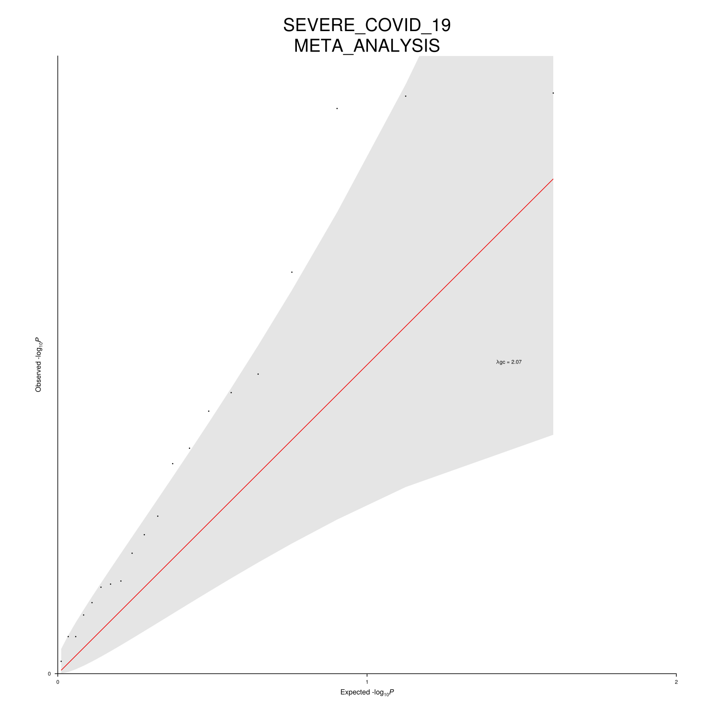

# Running WDL-GWAS Locally

**Expected Time**: 30 minutes (mostly waiting for the run to finish)

In this example, we demonstrate how to run the workflow locally, we thus assume the installation step was successful and that `CROMWELL_PATH` points to the cromwell jar file.

## Describing the workflow's inputs

Inputs to the workflow can be provided via a json file. In this example, we will replicate one of the test runs. Importantly, we will perform the analysis as follows:

- By group, defined by the SUPERPOPULATION column in the covariates file
- For two phenotypes: SEVERE\_PNEUMONIA and SEVERE\_COVID\_19 in the covariates file.
- The gwas will use `AGE`, `SEX` and `AGExSEX` as extra covariates.
- The groups results will further be meta-analysed (default if `groupby` is set) but exclude the "AMR" group from the meta-analysis stage.
- For this test dataset, fine-mapping thresholds have been lowered to yield some results

For illustration, a subset of the JSON file can be found here:

```json
{
    "gwas.meta_exclude": ["AMR"],
    "gwas.covariates_file": "test/assets/covariates/covariates.csv",
    "gwas.groupby": ["SUPERPOPULATION"],
    "gwas.covariates": ["AGE", "SEX", "AGE_x_AGE"],
    "gwas.phenotypes": ["SEVERE_PNEUMONIA", "SEVERE_COVID_19"],
    "gwas.genotypes": {
        "chr": "all",
        "bed": "test/assets/genotypes/genotypes.arrays_wgs.aggregated.bed",
        "bim": "test/assets/genotypes/genotypes.arrays_wgs.aggregated.bim",
        "fam": "test/assets/genotypes/genotypes.arrays_wgs.aggregated.fam"
    },
    "gwas.imputed_genotypes": [
        {
            "chr": "1",
            "pgen": "test/assets/imputed/chr1.qced.pgen",
            "psam": "test/assets/imputed/chr1.qced.psam",
            "pvar": "test/assets/imputed/chr1.qced.pvar"
        },
        {
            "chr": "2",
            "pgen": "test/assets/imputed/chr2.qced.pgen",
            "psam": "test/assets/imputed/chr2.qced.psam",
            "pvar": "test/assets/imputed/chr2.qced.pvar"
        },
        {
            "chr": "3",
            "pgen": "test/assets/imputed/chr3.qced.pgen",
            "psam": "test/assets/imputed/chr3.qced.psam",
            "pvar": "test/assets/imputed/chr3.qced.pvar"
        }
    ],
}
```

Note that each chromosome file needs to be filled independently, the full configuration file can be found in `config/local-inputs-example.json`.

## Running the workflow

From the repository's root, simply run:

```bash
java \
    -jar ${CROMWELL_PATH} run workflow.wdl \
    --inputs config/local-inputs-example.json \
    --options config/local-options-examples.json
```

The `--inputs` provides the workflow's input files and parameters while the `--options` flag provides other cromwell's [options](https://cromwell.readthedocs.io/en/latest/wf_options/Overview/), here the workflow's output directory.

If you are running on macOS, the above will error because docker won't find a suitable image for your platform. You will need to change the cromwell's [configuration](https://cromwell.readthedocs.io/en/latest/Configuring/), and you can for instance use the following config:

```bash
java \
    -Dconfig.file=config/cromwell.macOS.conf \
    -jar ${CROMWELL_PATH} run workflow.wdl \
    --inputs config/local-inputs-example.json \
    --options config/local-options-examples.json
```

## Outputs

The outputs will be found in the `gwas_outputs` directory. For example the poorly populated meta-analysis QQ plot for SEVERE\_COVID\_19, but well it is only a test dataset.

